`python3 -m http.server`

# Human Sightings Milestone Project for Code Institute

(aka my first ever website!)

So first of all I would like to point a finger to my file structure as this is the first thing I will be creating and it's a little unusual so will explain why now.

## How it all started

So my wife and I have a friend called Evie (they/them) and they have a website and a small business the website was a simple template downloaded from a site that allowed them to create a basic website but as you'll see the website doesn't do it's content justice. Their comics are all about hidden meanings and deep feelings but put in a way thats simple to understand and easy to grasp often quite comical. This kind of whimsical feel really isn't represented by their site as it stands so thought it would be a really good use of my Milestone Project to create something awesome for them that they will use. It also allows me to revisit it in the future and build upon it as I learn new skills allowing me to create a fully fledged website with lot's of functions. 

http://www.evelynbasch.co.uk/

Evies current website

## The plan

### how will this work in order for me to use this as my milestone project?

So the way it's working out is I am going to be the website designer! I'm going to treat it as if I am offering them a website design service.

### Step 1 - Initial sketches

I will send them an intial concept (on paper) asking about goals, ideas and wants from the new site. 

### Step 2 - Initial concept

I will then take it to the next step using adobe illustrator to put more detail behind the initial concept to gage the reaction

### Step 3 - Make it... yours!

If all goes well and the design is accepted I will then go to the flair stage where I ask them if they are able to do optional extras to improve the site. These would be things I would ask them to provide mostly optional that would give their website a real custom feel that only something they created could give. There's very little value in me trying to mimic what Evie can do mainly because they are actually an artist and I am only in the early stages of graphic design. 

### Step 4 - Make it real-ish

I will also create a wireframe fully interactable using adobe XD which they can comment on and discuss what they like and don't like this will most likely have temporary images I have created to give an idea of the final site rather than actual images as I will ikely not have them at this point.

### Step 5 - Permission

If they are happy with everything so far I will then request the images that I would need to create the site. This is NOT me asking for permission to distribute and would make it very clear these will be used solely with intent on creating a site that is custom for them to use and edit in the future. 

### Step 6 - Concrete foundations

Next Is development I would start by creating a basic file structure and each of the pages. I would also start creating a barebones version of the site with nothing on it other than empty boxes to show content placement and await any custom images from the artist.

### Step 7 - Level up!

Once I have gained the custom illustrations I would then start to put them in place to start adding the designs to the website.

### Step 8 - Alpha 

Once I have created the site it would then go into an alpha stage where I do everything I can to break it. If I succeed then I've failed discretely so that's a win for me as only me will know and I will take it to the grave. If I miss something that is where it becomes a true failure.

### Step 9 - Bug splat 

Get those bugs. Yes all of them. Every single one. SPLAT!

### step 10 - beta 

This is when I release it to Evie to play around with give them a lesson on how to change and update the site and let her test it out herself with a shareable link to share with whoever she likes in order to test it. 

### Step 11 - Submission

This is simple I send it over to YOU yeah you the person reading this I dedicated a whole step to just you.

### Step 12 - Top marks

Yeah I had to outsource for this part. Going to ask you to help me out here if you're up for it! What do you think? I hope you like it! tried my best to keep these notes interesting isn't it the worst when it's all straight facts and boring.
 "who's gonna read a readme if the readme tells everyone who reads it that it doesnt want to be read." - red dit

# Documenting The Creation

### Step 1 - Initial sketches

These were my intial sketches

Evie replied saying that they really liked the thought of the moons being the buttons to navigate and there being links to actual products from her website.

### Step 2 - Initial concept

So I doubled down on the idea and created a conecpt this is what they looked like

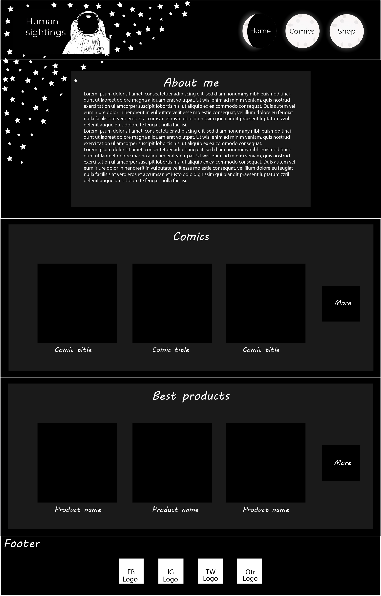

#### Desktop version

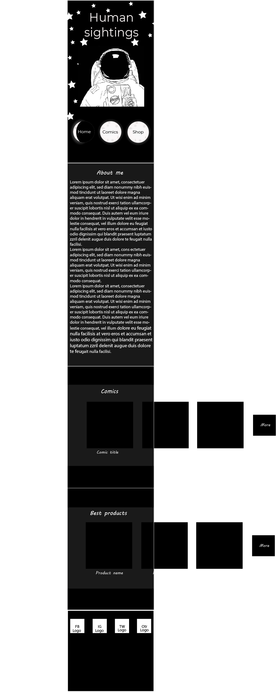

#### Mobile version

So you might notice here a few boxes seem to leave the page, early on after my sketches I realised implementing a background image the way I am would be very difficult due to the sheer length of the mobile version. So using a horizontal scroll section for the products and comics it allows me to keep the website at a certain length allowing for a much more efficient background usage.

### What evie thought

Evie really liked it and hinted towards being able to create starry background very quickly and would love to create the moons so I sent her the following image so she could edit it. I sent it as a .psd file so they could edit it using layers allowing them to toggle the object in and out and not have to draw ontop. You'll notice a light coloured line here this is my indicating what part of the website will be visible on the mobile version of the site so the page doesn't have to swap images instead it will zoom into a section of the background image when device it is displayed on gets too small.

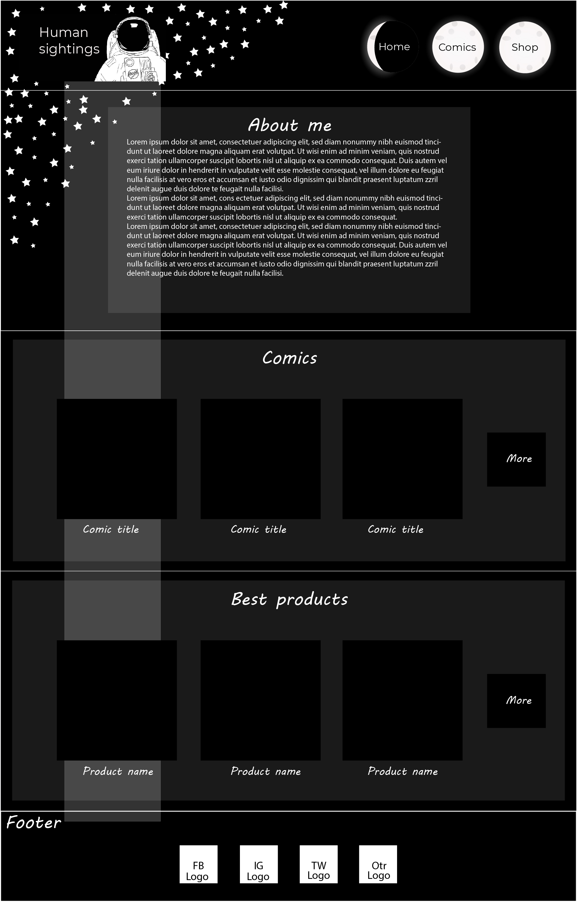

### Step 3 - Make it... yours!

Here is when I asked Evie if they would like to create images so gave a few options due to the nature of her previous requests to create her own background and navigation items these were mandatory
moons
background 
the next few were optional
more alien - an alien that holds a sign saying more the sign would be clickable/tappable and take the person to the corresponding link.
footer alien - an alien that sits right at the bottom of the site with a thumbs up to encourage checking social links.
various aliens inbetween sections - these will be funny illustrations of aliens in rockets or just stars or planets in the background image.
a square border image for products and comics - this is just to go round the thumbnail images of the products and comics on the homepage to add a bit of custom flair.

### Step 4 - Make it real-ish

This was fun!
I've added a link to the actual wireframe here the site only had two comic pages as it was all I needed to show it's basic functions the actual site will have many more. (please don't comment if the option is available)
https://xd.adobe.com/view/ee71d7c4-772d-4a0b-b349-adecd6618a67-bb22/

If either someone unauthorised comments or the link expires I've also added each page below
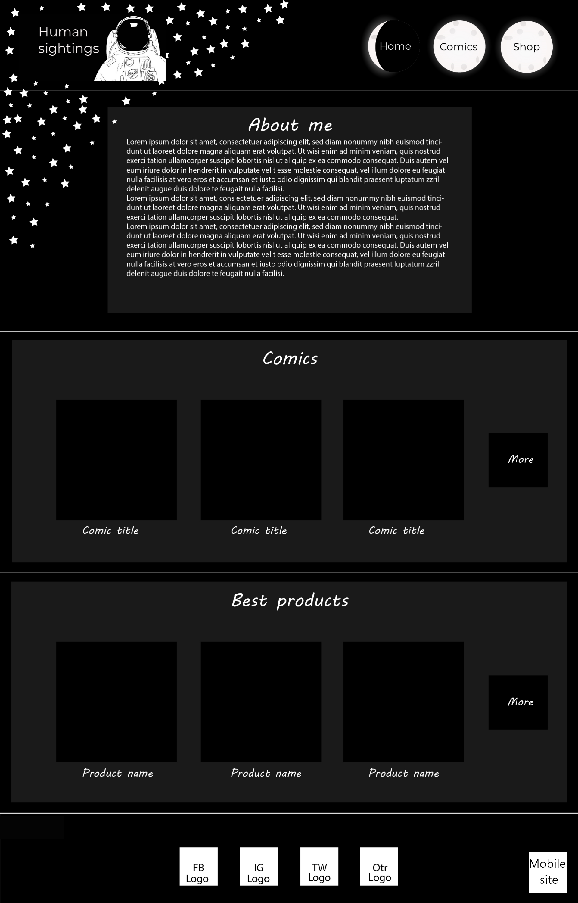
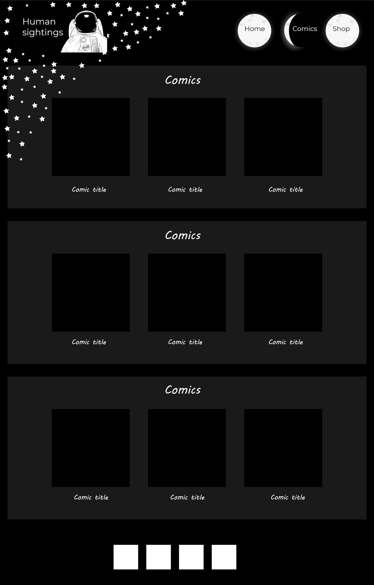
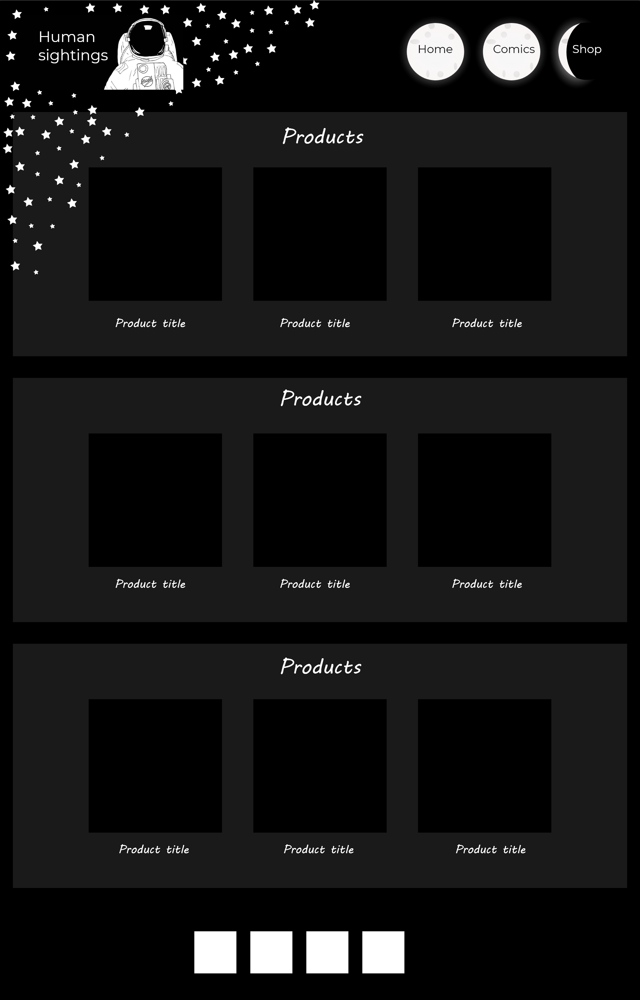

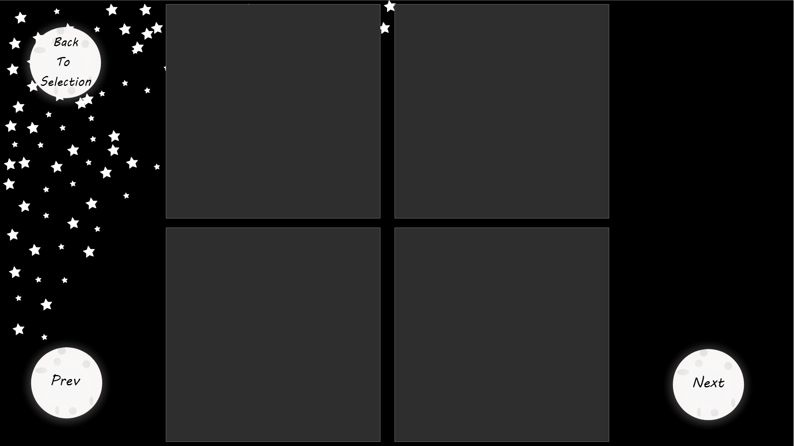

##### desktop wireframe

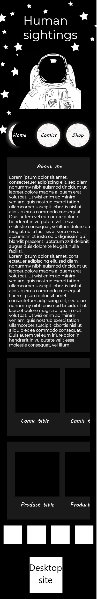
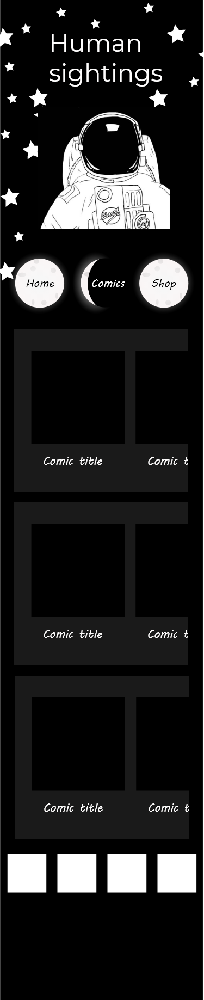
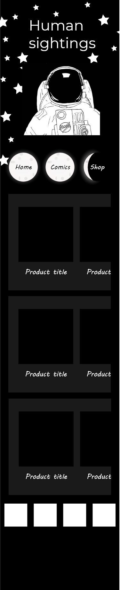

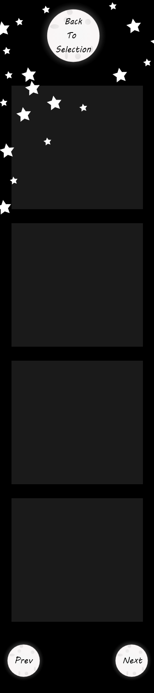

##### mobile wireframe 

Evie 

## the method behind the madness

In the images section so you'll see I have sub folders with comic-1,comic-2 etc. and you'll see some empty folders with the names of the comics with nothing in them so these are here temporarily until I have finished the comic pages just so I know what each comic is called as you can tell I have names like comic 1 comic 2 comic 3 and this is simply due to being lazy! They say the best coders are lazy coders right! so essentially I have to create the comic with all it's links to the images once. Then when I'm ready to create a new comic page I then simply copy and paste change comic 1 to comic 2 on the links and slide-1, slide-2, slide-3, and slide-4 all just slip into place where they are supposed to go.

### Step 5 - Permission

Evie is happy with the designs and is happy for me to continue to the development stage.

### Step 6 - Concrete foundations

This is where the development diary starts see below 08/11/2021 - 

### Step 7 - Level up!

# Dev diary

## 08/11/2021

### Goal

Today my goal is to set up the file structure and start doing the header of the page.

### progress 

actual progress completed the header added the background and created all nav elements and linked them to the correct pages also made the header completely responive over all device sizes and in-between sizes.
