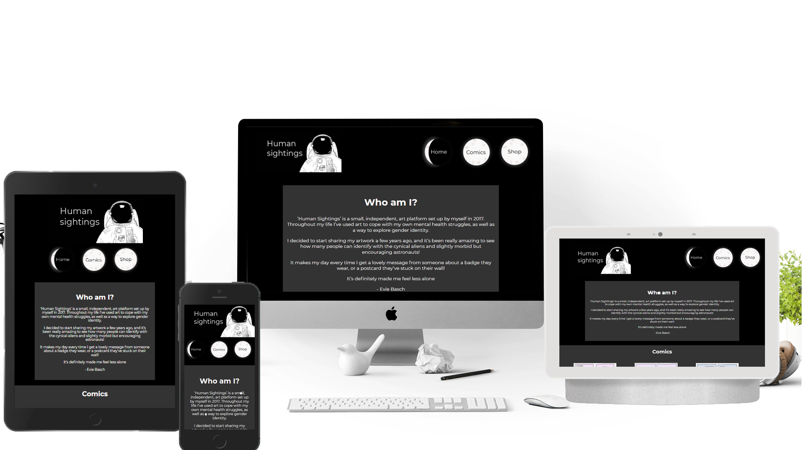
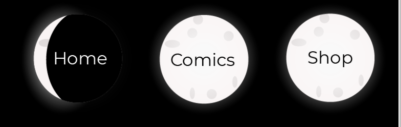

# [Human Sightings](https://thebrightsparkdev.github.io/Human-Sightings/)

Link to site [Human Sightings](https://thebrightsparkdev.github.io/Human-Sightings/)

Human Sightings is a site for people to come and take a look at some comics and potentially follow a link to purchase some products
the site is also there to introduce poeple to the wonderful art of Evelyn Basch. It's designed to replace the previous site they had
and incorporate her style into everything, from headers to backgrounds it's all space themed and fun. Users of the site will already be fans of Evelyns or potential new fans.

desktop and background credit: [pixabay](https://pixabay.com/photos/apple-computer-desk-workspace-1868496/)

## Features 

### The best bits

- __Navigation Bar__

  - Featured on all the main pages the navigation bar is the first evelyn themed art you'll see three glorious moons with one of them being eclipsed slightly to show what page you are currently on.
  - This will allow users to go from page to page easily and know what page they are currently on

- __About us section__

  -  Since the page is all about introducing people to Evie this is where they can add information about themselves and who they are.
  -  Users will be brought in by this section and start to learn more about them 

- __Comics section__

  - This is the first opportunity for users to be introduced to the wonderful aliens that Evie is known for drawing. These will be introduced as clickable links to take users to the comic pages. There are in total 9 comics but only the first 3 are shown here with an option to view more which links to the comics page. 
  - Not only will the user start to learn about the characters and their deep emotional thoughts they will hopefully relate to some and later on that may drive them to buy some of the products that displays some of the funny or deep quotes that lie within the comics. 

- __Shop__

  - This is the first opportunity for users to be redirected to the etsy site where purchases can be made for the products hopefully they would've seen the comics first and known some backstories behind the products.
  - This section is where the user can go if they want to support the creator and purchase some items the creator hand- manufactures 

- __The Footer__ 

  - The footer contains links to many of the artists different social sites from facebook to instagram and even an etsy link too. 
  - The footer is a visual indicator to users that the page is finished and that they can click into any of the links to get to know the artist more.

- __Comics Page__

  - The comics page is all about comics and meeting the various character and laughing or crying with them as they go through some of the
  toughest subjects and whackiest scenarios
  - This section is all about users having a look around they are more than welcome to click on any comic and with the template its always going to be easy to add more. 

- __Shop Page__
  
  - The shop page is all about getting that click-through rate at this point the users would've fallen in love with the aliens and astronauts and are maybe thinking about potentially making a purchase to support the artist.
  - This section is simply a place for users to browse product and click links into the Etsy page.

# Wireframes
### Initial sketches

[interactive wireframe](https://xd.adobe.com/view/ee71d7c4-772d-4a0b-b349-adecd6618a67-bb22/?fbclid=IwAR0fa72zMo3DBl431YA561xTuZnfWh-Xeg256Z00F5y_93f-5IRJdl367yY)

To access the mobile version go to the homepage on the desktop scroll to the bottom and there's a button there saying mobile version do the same to go back to desktop version from mobile.

## Desktop
[Homepage](https://github.com/TheBrightSparkDev/Human-Sightings/blob/main/assets/images/readme-images/wf-dktp-home.png)
[comics](https://github.com/TheBrightSparkDev/Human-Sightings/blob/main/assets/images/readme-images/wf-dktp-comics.png)
[shop](https://github.com/TheBrightSparkDev/Human-Sightings/blob/main/assets/images/readme-images/wf-dktp-shop.png)
[comic page](https://github.com/TheBrightSparkDev/Human-Sightings/blob/main/assets/images/readme-images/wf-dktp-comic-1.png)
##### note to reader the links above are exactly the same as the live wireframe I strongly recommend you use the interactive wireframe instead.

## Mobile 
[Homepage](https://github.com/TheBrightSparkDev/Human-Sightings/blob/main/assets/images/readme-images/wf-mob-home.png)
[comics](https://github.com/TheBrightSparkDev/Human-Sightings/blob/main/assets/images/readme-images/wf-mob-comics.png)
[shop](https://github.com/TheBrightSparkDev/Human-Sightings/blob/main/assets/images/readme-images/wf-mob-shop.png)
[comic page](https://github.com/TheBrightSparkDev/Human-Sightings/blob/main/assets/images/readme-images/wf-mob-comic-1.png)
##### note to reader the links above are exactly the same as the live wireframe I strongly recommend you use the interactive wireframe instead.

# Technology used
## Frameworks
- I used github to store the repository and version management
- I used gitpod for editing the code and for posting to github 
## Libraries
- I used [bootstrap](https://getbootstrap.com/) for the comic individual pages
- I used [Font Awesome](https://fontawesome.com/) for the icons at the bottom of the index, comics, shop pages.

# user story 

The users are people that simply want to look at comics that have a deeper meaning and to feel how the artist was feeling during the comics. The page is a rollercoaster of emotions from sadness to loneliness to sillyness and immaturity. It's somewhere people can go to know that they aren't alone in a way that they are not expecting. It's not there to directly support but the page is there to just slightly reinforce that it will be okay. It also gives the people an opportunity to support the artist to create more too with links to the etsy page.

### Features Left to Implement

- The comics page is free to be expanded on whenever a new comic becomes available.

- The shop page is also expandable as there are always more products being added.

- Potentially add additional pages for each product to give a better description into what they are.

- Opportunity in the future to take purchases directly on the site to increase profits per item and avoid etsy cut.

- Opportunity to also add a log when I'm able to use Javascript to make it easy for the creator to create additional pages.

- Make the page look good on a mobile in landscape mode.

## Testing 

### Issues during development 
- Header not being responsive 
  - Messaged on slack about using a div element instead of header before looking into flexbox.
  - Found my answer on a website: [Flexbox How To](https://css-tricks.com/snippets/css/a-guide-to-flexbox/)
  - Messaged to say I found my own answer all good to not waste anyones time.
  - Fixed using flexbox instead of using widths was quite a quick fix in the end.

- Was struggling to make the logo responsive initially 
 - Issue I was having was that the text would not stay in the same place ontop of the logo no matter what I did and as the image got smaller the text wouldn;t look right so had to figure out how I was going to have the text be the right size on all screens.
 - I fixed it by being lazy I added the text to the logo image and no the text resizes automatically as it is now literally part of the logo.

 

 - I later used this trick again with every moon link on the page
 - No external resources were used to find this fix 
 - Used Adobe photoshop to edit images

- Having trouble implementing the horizontal scroll menu
 - Read up on it here: [horizontal Scroll Menu](https://www.w3schools.com/howto/howto_css_menu_horizontal_scroll.asp)
 - Fixed my issue implemented the correct code, code NOT copy and pasted.

- Had to toggle between using a flexbox and horizontal scroll so had a quick reminder on how media queries worked info found here: [Media Queries How To](https://www.w3schools.com/css/css_rwd_mediaqueries.asp)

- I have tested the website on every screen size from 250px to 2560px and the website is responsive and readable at all sizes. The way I did this was by using google chrome and using all the default devices and also sliding slowly the responsive section to and checking as I slide. 

- I did all the validation tests and encountered a few issues
  - issue 1 was that I had used aria-described by instead of aria-label (this was an easy fix just replaced every mention of describedby with label)
    - Info on fix found here: [aria-label/labelledby](https://tink.uk/the-difference-between-aria-label-and-aria-labelledby/)
  - issue 2 was that I had used aria-labels on my icons at the bottom of the page after a quick look into what I should ideally be using it was a quick and easy fix credit goes to [font awesome accessibility page](https://fontawesome.com/v4.7/accessibility/)
  - issue 3 was that on the individual comic pages I had used an ID for the comic title (which I then copy and pasted 3 times per page to be displayed at different locations depending on the screen size) this casues another issue on the HTML validator again another easy fix changes the id to a class on style.css and all affected html files
  - issue 4 was that on the individual comic pages I mustve not closed the uppermost DIV which I wasn't aware was an easy fix to close the div just above the body end tag.

- I uploaded the link to my site to slack and asked for any advice from my fellow peers 
  - I had one reply from SuzyBee_lead "Having a quick look on mobile at it looks great! Well done!"
  - I also sent the link to the website over to my friends and they all loved it too asked them to try their best to break it none succeeded
  although there were comment into the usability of the comics pages on a mobile phone in landscape mode. I agreed but am yet to implement a fix.

- I did my best to break the site myself only succeded on sizes less than 250px wide which nowadays is unusual and not something I plan to fix or improve going forward.

- I went on my mobile and used my screen reader software to test if it works and the whole website has detailed descriptions for every single image and text also reads out well so can confirm everything is accessible to the visually impared. 

- I used google lighthouse to generate a report and spotted a few problems 
 - Firstly the best-practices were low so took a closer look and spotted that I hadn't put noreferrer on the external links which can be dangerous in some situations as it allows the site I have linked to the opportunity to use the site I have created to steal user info. I understand this is extremely low risk and low probability of causing issues as firstly users cannot input info into the page I have created at any point and secondly it's extremely unlikely someone is going to specifically target such a low traffic page. Still though it's better to be safe than sorry.
 - I also spotted the SEO wasnt 100% due to not having meta tags so was an easy enough fix to implement.
 - I also saw that google said background.png came back with a 404 error had a look into my css and it was an absolute link instead of relative so corrected the issue

- google lighthouse gave a few scores in the end:

 - Performance 84% This is due entirely to the images I have used I could've edited every single image and turned them into next gen-formats but I don't have that kind of time to dedicate to this project.
 - accessibily 100% This is something I hope all my websites will always say
 - best practices 73% 

### Validator Testing 

- HTML
  - No errors were returned when using the official [W3C validator](https://validator.w3.org/nu/?doc=https%3A%2F%2Fcode-institute-org.github.io%2Flove-running-2.0%2Findex.html)
- CSS
  - No errors were found when using the official [(Jigsaw) validator](https://jigsaw.w3.org/css-validator/validator?uri=https%3A%2F%2Fvalidator.w3.org%2Fnu%2F%3Fdoc%3Dhttps%253A%252F%252Fcode-institute-org.github.io%252Flove-running-2.0%252Findex.html&profile=css3svg&usermedium=all&warning=1&vextwarning=&lang=en#css)

### Unfixed Bugs

The individual comics page can be quite hard to implement AND make responsive so adding new pages may prove time consuing in the future I look to create a few templates to the artist can easily add her own in the future rather than contacting me to add them everytime. 

Not so much a bug but a preference that is against the nrom when it comes to naming conventions. Using naming patterns like 1slide1 1slide2 1slide3 enables me to absolutely fly through adding extra content as long as I have a template for the layout of course. To create all the comic pages correctly all I have to do is update the first number so lets same I go from page 9 and add a page 10. I copy and paste the HTML file and all I need to do to add a new slide is to change four numbers and of course the previous/next links and the title.

This allows for rapid deployment in the future. The system really is quite intuitive also due to each page being named comic-1 comic-2 so you know that 1slide1 1thumbnail are for comic-1 etc. 

comic page doesnt look great on landscape mode on a mobile 

## Deployment

I was using github as the repository for the whole project so when I wanted to create a live page it was very easy to do.

I did however have trouble with relative vs absolute links as I found I had accidentally used alot of absolute which meant the page was broken when uploaded. Was a simple fix!

- The site was deployed to GitHub pages. 

The live link can be found here - [Human Sightings](https://thebrightsparkdev.github.io/Human-Sightings/)

## Credits 

Below are the sources of all the media and content 

### No parts of the code on this website are copy and pasted 

 - If I was struggling with anything I would simply go to wesbite that I have linked below and read up on how to use the specific code and then I would simply use the code correctly. 
 - all websites used are linked below:
  - [Flexbox How To](https://css-tricks.com/snippets/css/a-guide-to-flexbox/)
  - [aria-label/labelledby](https://tink.uk/the-difference-between-aria-label-and-aria-labelledby/)
  - [Media Queries How To](https://www.w3schools.com/css/css_rwd_mediaqueries.asp)
  - [horizontal Scroll Menu](https://www.w3schools.com/howto/howto_css_menu_horizontal_scroll.asp)

### Content 

- The text for the about us section was from her origional site [origional site](http://www.evelynbasch.co.uk/)
- Shop links are from etsy and so are the images (with artist permission of course) [Etsy page](https://www.etsy.com/uk/shop/HumanSightings)
- The icons in the footer were taken from [Font Awesome](https://fontawesome.com/)
- How to do aria-labels for font awesome icons [font awesome accessibility page](https://fontawesome.com/v4.7/accessibility/)
- Bootstrap was used to create the comic pages although I should've used a custom grid with more columns for greater customisation. [bootstrap](https://getbootstrap.com/)

### Media

- The photos used were either from my own illustrations (background and moons) or from Evie's many comics
- Shop links are from etsy and so are the images (with artist permission of course) [Etsy page](https://www.etsy.com/uk/shop/HumanSightings)
 
 # More coming soon! 
 
 ### Follow me on github to stay upto date and message me for project ideas/pitches always ready to work with someone.